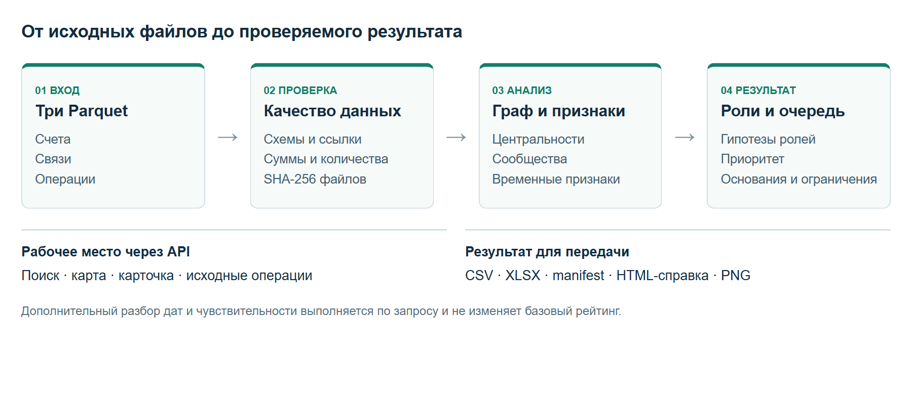

# Граф денег — ScreenMentor / HackAlem AI

Было разработано рабочее место AML-аналитика: три файла с банковскими переводами превращаются в очередь проверки счетов, направленный граф, гипотезы ролей и проверяемые факты. Аналитик видит, почему счёт получил приоритет, какие исходные переводы подтверждают признаки и каких данных не хватает для вывода.

## Проблема и решение за одну минуту

В таблицах переводов трудно быстро увидеть общую картину и выбрать счета для проверки. При этом неполную выгрузку легко истолковать неверно: отсутствие исходящих не доказывает, что деньги остались на счёте.

«Граф денег» помогает пройти три шага: **выбрать счёт → проверить переводы → сохранить результат**. Сайт объясняет, что обратило на себя внимание, показывает связи и даты, открывает исходные строки и формирует справку. Оценки помогают организовать работу аналитика; они не устанавливают нарушение.

Начните с [краткого описания для жюри](FOR_JUDGES.md) или [подробной инструкции пользователя](USER_GUIDE.md). На самом сайте инструкция доступна по кнопке **«Как пользоваться сайтом»**. Далее в README находятся технические сведения и команды запуска.

## Материалы для знакомства и проверки

### Работающий сайт и доступ

**[Открыть ScreenMentor «Граф денег»](https://screenmentor-uwfohh6hz.gobrev.dev)**

Проект размещён в NVIDIA Brev, для сайта включён публичный доступ. Регистрация и пароль приложения не нужны. Откройте ссылку и начните с учебного набора: выберите счёт, изучите его связи и откройте исходные операции.

Если ссылка не открывается, воспользуйтесь локальным запуском ниже. Инструкция по обслуживанию сервера и настройкам доступа находится в [DEPLOY_BREV.md](DEPLOY_BREV.md). Исходные файлы кейса не включены в Docker-образ и открытый репозиторий.

### Четыре пункта для проверяющего

| Вопрос | Ответ и где проверить |
| --- | --- |
| Что решает продукт? | Помогает аналитику выбрать счета для проверки, проследить переводы и сохранить проверяемые основания. См. «Проблема и решение за одну минуту» выше. |
| Как запустить? | Открыть размещённый сайт либо выполнить команды раздела «Быстрый запуск» / «Docker». Для сервера — DEPLOY_BREV.md. |
| Какие технологии? | Python, FastAPI/Uvicorn — API; pandas, NumPy, PyArrow — таблицы и Parquet; NetworkX, SciPy — графовые вычисления; HTML/CSS/JavaScript и Cytoscape.js — интерфейс и карта; Docker — запуск, NVIDIA Brev — хостинг. Внешняя LLM не участвует в обработке переводов. |
| Как проверить решение? | Пройти сценарий ниже; автоматические проверки и воспроизводимый CLI-прогон описаны в разделе «Проверка». |

### Проверка сайта за пять минут

1. Открыть сайт без авторизации. Уточнить название набора: в учебном примере используются искусственные данные.
2. Выбрать счёт из очереди, прочитать роль и основания приоритета; найти этот же счёт по полному ID.
3. Открыть карту, перейти к соседнему счёту и вернуться кнопкой истории. Проверить подписи ID и направление связей.
4. Нажать «Проверить переводы этого счёта», открыть исходную операцию, сопоставить сумму и дату с объяснением; прочитать ограничения вывода.
5. Скачать XLSX, проверить полный ID, суммы, выравнивание и границы ячеек. Открыть справку по выбранному счёту. Для конкурсного формата отдельно скачать CSV и manifest.
6. Для проверки на новом наборе загрузить три разрешённых файла Parquet. Сопоставить число счетов, результаты и исходные строки; повторить CLI-прогон по инструкции ниже. Подробный сценарий — [DEMO_SCRIPT.md](DEMO_SCRIPT.md).

| Материал | Что в нём найти |
| --- | --- |
| [Полный обзор возможностей](PROJECT_FEATURES.md) | Все пользовательские функции, детали навигации, оформления, точности, ошибок и хранения; для чего они нужны и где реализованы |
| [Инструкция пользователя](USER_GUIDE.md) | Действия на сайте, значения показателей, работа с картой, заметками и экспортом, устранение затруднений |
| [Описание для жюри](FOR_JUDGES.md) | Проблема, решение, проверяемые отличия и границы выводов |
| [Отчёт Word](docs/ScreenMentor_Project_Report.docx) | Оформленный обзор проекта со схемой решения, иллюстрациями и результатами проверок |
| [Текст отчёта](docs/PROJECT_REPORT.md) | Доступная в репозитории текстовая версия отчёта |
| [Сценарий защиты](DEMO_SCRIPT.md) | Пятиминутная демонстрация с живым расчётом и разбором нескольких счетов |
| [Размещение в NVIDIA Brev](DEPLOY_BREV.md) | Использование кредита, выбор сервера, Docker, HTTPS-ссылка и доступ жюри |

## Почему интерфейс устроен именно так

**Навигация.** Три шага связывают очередь, проверку переводов и результат. Поиск работает по полному ID и части номера во всём наборе; счётчик показывает, сколько найдено и сколько отображено. На карте есть возврат к прежним счетам, переход вперёд и последние три позиции истории. История просмотра подписана отдельно от денежного маршрута. Настройки и выбранный счёт восстанавливаются после обновления, пока запуск доступен.

**Читаемая карта.** Стрелки показывают направление, цвет — предполагаемую роль, форма и рамка — стартовый статус и границу данных. Идентификаторы включены по умолчанию; при совпадении окончаний подписи удлиняются. При наведении видны полный ID и ближайшие связи. Направления поступления и отправления, глубина в один или два перехода и постепенное раскрытие 30–400 узлов позволяют изучать окружение по частям. Кнопки масштаба и «Вписать граф» доступны без колёсика; вписывание работает внутри области карты.

**Понятные объяснения.** Краткий наблюдаемый факт, ограничения и следующее действие стоят перед техническими деталями. Формулы доступны в раскрываемом блоке. Подсказки объясняют разницу между операциями и связями, баллами и вероятностью, оборотом и уникальными деньгами. Логотип, единые подписи и адаптивная компоновка поддерживают узнаваемость и последовательность управления.

**Точные и оформленные результаты.** XLSX содержит четыре листа, явные текстовые ID, числовые оценки, закреплённые заголовки и фильтры листов результатов. Все ячейки выровнены по центру по вертикали и горизонтали и имеют границы; объяснения переносятся. CSV сохраняют конкурсный формат и не поддерживают оформление. PNG передаёт текущий вид карты, HTML-справка — основания и ограничения одного счёта. Личные заметки в аналитические выгрузки не включаются.

**Продолжение работы и ошибки.** Избранное, этапы, заметки и сравнение двух счетов отделены от расчёта. Наборы различаются по хешам входов. При отказе браузерного хранилища показано предупреждение; при быстрой смене счёта устаревшие ответы не подменяют новую карточку. Учебный пример открывается в отдельной вкладке. Инструкция описывает также утрату запуска, ограничения карты и особенности Excel.

Подробное поведение и ограничения каждой детали приведены в [PROJECT_FEATURES.md](PROJECT_FEATURES.md). Понятность интерфейса проверялась функциональными браузерными сценариями; исследования с AML-аналитиками пока не было.

Кейс №3 «Граф денег»: [условие организатора](https://docs.google.com/document/d/1JPLU-G6R25Ge2hVaY2J9cqvrx7FGExj87XKwJPaMz3o/preview). Репозиторий проекта ScreenMentor.

## Что работает

- Загрузка nodes.parquet, edges.parquet, transactions.parquet; проверка схем, ссылок, сумм и количества переводов.
- Расчёт по всем счетам, включая изолированные: шесть ролей, выраженность признаков, приоритет, сообщества Louvain.
- Поиск по полному или частичному gid, фильтры по роли и сообществу; окружение в один или два шага, фильтр направлений поступления/отправления, денежные стрелки и агрегаты. На карте сначала до 30 счетов, раскрытие по 30 до 400; подсветка ближайших связей, полный ID при наведении, включаемые подписи, собственные кнопки истории переходов.
- Карточка с разложением приоритета, исходными операциями и номерами строк, ограничениями и следующими проверками.
- Три конкурсных CSV и manifest.json с хешами входных файлов и параметрами.
- XLSX для Excel: все результаты на отдельных листах, точные текстовые gid и кириллица без настройки импорта.
- Разбор цепочек от seed с проверкой последовательности дат; хронология входящих/исходящих по дням.
- Переход от отдельного признака к конкретным операциям, подсветка подтверждающих связей.
- Восемь вариантов изменения весов, сравнение топ-20 с очередями по обороту и числу связей.
- Самостоятельная HTML-справка по счёту с графом и источниками, пригодная для печати в PDF.
- Локальный помощник с четырьмя вопросами по рассчитанным фактам и ссылками на операции.
- Избранное, личные заметки и этапы проверки в браузере; отдельное хранение по хешам входных файлов.
- История последних 30 переходов, восстановление фильтров и текущего доступного запуска после обновления.
- Сравнение двух счетов по готовым показателям; PNG текущей карты с контекстом и легендой.
- Учебный сценарий из пяти шагов на отдельном синтетическом наборе, открываемый в новой вкладке.
- Локальная работа без платных API и GPU. Синтетический пример встроен; закрытые данные организатора в репозиторий не включены.

В текущем MVP нет языковой модели: анализ выполняют графовые алгоритмы и явные правила. Помощник отвечает на четыре заданные темы, свободный чат не реализован. `role_score` — выраженность признаков, а не вероятность класса. Приоритет не является оценкой виновности. Публичная размещённая версия пока не настроена.

## Быстрый запуск

Python 3.12 (проверенная среда), интернет нужен только для установки зависимостей. Команды выполняются из корня репозитория. JavaScript-библиотека для графа уже включена, Node.js для запуска не требуется.

Windows PowerShell:

```powershell
python -m venv .venv
.venv\Scripts\python.exe -m pip install -r requirements.txt
.venv\Scripts\python.exe -m uvicorn backend.api:app --host 127.0.0.1 --port 8765
```

Linux / macOS:

```bash
python3 -m venv .venv
.venv/bin/python -m pip install -r requirements.txt
.venv/bin/python -m uvicorn backend.api:app --host 127.0.0.1 --port 8765
```

Откройте **http://127.0.0.1:8765**. По умолчанию создаётся явно подписанный синтетический набор. Для реальных данных нажмите «Загрузить файлы» и выберите три Parquet. Альтернатива — перед запуском задать папку:

```powershell
$env:GRAPH_DATA_DIR='C:\path\to\data'
.venv\Scripts\python.exe -m uvicorn backend.api:app --host 127.0.0.1 --port 8765
```

Указывайте непосредственно папку с тремя файлами: в архиве организатора она может быть вложена в `data (1)/data`. Linux: `GRAPH_DATA_DIR=/path/to/data .venv/bin/python -m uvicorn backend.api:app --host 127.0.0.1 --port 8765`.

### Только расчёт и конкурсные файлы

```powershell
.venv\Scripts\python.exe -m backend.pipeline --demo --output artifacts/demo-result
.venv\Scripts\python.exe -m backend.pipeline --input 'C:\path\to\data' --output artifacts/case
```

Выберите одну команду: `--demo` для воспроизведения без данных организатора или `--input` для своего комплекта. На Linux замените путь к Python на `.venv/bin/python`.

### Docker

```bash
docker build -t money-graph .
docker run --rm -p 127.0.0.1:8765:8765 money-graph
```

Контейнер по умолчанию показывает синтетический набор. Для набора кейса примонтируйте каталог только для чтения в `/data` и задайте `-e GRAPH_DATA_DIR=/data`. 23 сентября 2026 года Linux-образ успешно собран в Docker Desktop; проверены запуск непривилегированным пользователем, volume результатов, пароль, API, интерфейс, инструкция, логотип и скачивание XLSX с 26 счетами учебного набора. Это локальная проверка контейнера. Приложение также размещено в NVIDIA Brev; ссылка находится в начале README. [Пошаговый запуск в NVIDIA Brev](DEPLOY_BREV.md).

## Входные данные

| Файл | Обязательные поля |
| --- | --- |
| nodes.parquet | gid: целое, depth: целое 0–4, is_seed: bool |
| edges.parquet | src, dst: целые; sum_kzt: число; n_tx: положительное целое; depth: 1–4 |
| transactions.parquet | src, dst: целые; date: дата без часового пояса; sum_kzt: число |

`gid` уникален; агрегированная пара `(src, dst)` уникальна. Все ссылки должны присутствовать в nodes. `is_seed` соответствует depth=0. Суммы неотрицательные, не более двух знаков после запятой. Проверка агрегатов использует целые тиыны. Неизвестные поля допускаются, но не используются. Несогласованные входы отклоняются с объяснением.

Одинаковые строки transactions сохраняются: отдельного идентификатора платежа в схеме нет, поэтому считать их ошибочными дублями нельзя. Идентификаторы счёта никогда не преобразуются в float: на сервере это точные целые, в JSON/браузере — строки. Для Excel скачивайте **results.xlsx**: gid и top_gids имеют явный текстовый тип ячейки. Оценки, суммы и количества — числовые значения, кроме сумм с более чем 15 значащими цифрами, которые сохраняются текстом ради точности. CSV остаётся машинным форматом; при импорте в Excel выбирайте UTF-8, разделитель «запятая», gid/top_gids как текст, десятичный разделитель «точка».

Лимиты прототипа: 20 000 узлов, 100 000 рёбер, 200 000 операций; загрузка до 15 МБ на файл и 30 МБ на комплект. Это ограничения входа, а не обещание одинакового времени на предельном размере. Последние 8 расчётов хранятся в памяти процесса, исходный запуск сохраняется. Файлы расчётов остаются локально в `artifacts/`; автоматическая очистка не реализована. Используйте один worker сервера.

## Метод и воспроизводимость

1. Проверка файлов; SHA-256 каждого исходника. Строки платежей получают номер позиции в исходном Parquet, начиная с 1.
2. Направленный граф строится из **всех** nodes; ребро хранит сумму и число операций. Учитываются входящие/исходящие контрагенты, обороты и операции.
3. PageRank взвешен суммой переводов. Betweenness приближённый, по максимум 32 опорным узлам, seed=42; денежная сумма не используется как длина пути. Число стартовых ветвей — количество seed, из которых достижим счёт, включая сам seed.
4. Louvain: неориентированная проекция, веса двух направлений складываются, петли и нулевые веса не влияют на сообщества, seed=42. Изоляты остаются отдельными сообществами. Нумерация по минимальному gid сообщества.
5. Для каждой роли считается оценка по таблице ниже. Выбирается максимальная оценка при значении ≥0,5; иначе `peripheral`. При равенстве порядок лексикографический. Альтернативы ≥0,35 показаны отдельно.

Обозначения: `cap(x)=min(x,1)`; `in/out` — количество контрагентов; `it/ot` — число операций; `s` — число стартовых ветвей; `r` — исходящая сумма / входящая сумма; `L` — число исходящих, за 1–2 календарных дня перед которыми было любое входящее; `d` — число активных дней исходящих; `B` — процентиль betweenness; `c` — число соседних сообществ, отличных от собственного.

| Роль | Условие и оценка |
| --- | --- |
| consolidator / сбор | in≥3: 0,55 cap(in/12) + 0,30 cap(s/5) + 0,15 cap(it/24) |
| distributor / распределение | out≥5: 0,70 cap(out/25) + 0,30 cap(ot/40) |
| transit / транзит | Не seed; in и out>0; L>0; 0,5≤r≤1,5: 0,45 max(0,1−abs(r−1)/0,5) + 0,35 cap((L/ot)/0,5) + 0,20 cap(d/3) |
| terminal / предполагаемый конечный получатель | in≥2, it≥3, поступления минимум в 2 разных дня, out=0, depth<4, последнее входящее минимум за 3 дня до конца набора: 0,35 + 0,30 cap(in/5) + 0,15 cap(it/10) + 0,20 |
| coordinator / связующее звено | s≥2, c≥2, B≥0,75, out>0: 0,50 B + 0,30 cap(s/5) + 0,20 cap(c/4) |
| peripheral / недостаточно признаков | Ни одна оценка не достигла 0,5; role_score=0 |

Приоритет от 0 до 1:

```text
0,35 × (0,60 × percentile(PageRank) + 0,40 × percentile(betweenness))
+ 0,30 × cap(число стартовых ветвей / 5)
+ 0,20 × percentile(входящий + исходящий оборот)
+ 0,15 × role_score
```

Процентили считаются по всему набору, при равенстве — средний ранг; нулевые метрики дают нулевой вклад. Изолятам приоритет принудительно 0. Ранжирование по убыванию приоритета и точному gid для разрешения равенств. Пороги — эвристики MVP, не обученные параметры. Нет размеченных ролей, поэтому accuracy/F1 не заявляются. Тесты проверяют корректность вычислений и контрактов, а не качество выявления противоправных действий.

В методе 1.1 добавлены минимальные требования к временным признакам транзита и повторяемости поступлений для terminal. Один входящий перевод больше не даёт гипотезу terminal. На наборе кейса число таких гипотез изменилось с 1 021 до 42; transit — с 72 до 52. Это следствие более консервативных правил, а не доказанное улучшение точности. Пропущенные случаи и пороги требуют экспертной проверки. Экспорт и приоритеты разных версий метода могут отличаться.

### Разбор цепочек, времени и устойчивости

Во вкладке «Цепочки переводов» строится по одному кратчайшему направленному пути от каждого достижимого seed до выбранного счёта, максимум 6 рёбер. Для выбранного seed дополнительно рассматриваются до 8 исходящих путей глубиной до 3. Показаны до 8 примеров; при равенстве порядок детерминирован. Альтернативные пути между той же парой не перебираются. Отсутствие последовательности у показанного пути не исключает её на другом.

Для фиксированного пути алгоритм выбирает самую раннюю подходящую операцию на каждом следующем ребре:

- Строго возрастающие даты: существует последовательность по дням.
- Только неубывающие даты: порядок внутри одного дня неизвестен.
- Ни одна неубывающая последовательность не существует: даты не подтверждают этот маршрут.

Даты сравниваются на календарном уровне, даже если загруженный набор содержит время. Суммы не сопоставляются как одни и те же деньги. Стрелки показывают агрегаты пары за весь период; список источников — отдельные выбранные платежи с датами, суммами и номерами строк. Вкладка «По дням» показывает фактические входящие и исходящие выбранного счёта. «Проверить факт» раскрывает только соответствующие входящие, исходящие или исходящие с поступлением за 1–2 дня; возможные предшествующие поступления доступны отдельно.

Во вкладке «Проверка приоритета» каждый из четырёх весов по очереди меняется на −20% и +20% относительно базового значения, затем все веса нормируются до суммы 1. Восемь сценариев показывают диапазон мест выбранного счёта и пересечение с базовым топ-20. Дополнительно доступны сравнения с сортировками только по обороту и по числу связей. Это анализ чувствительности к весам при фиксированных ролях/графе, не доверительный интервал и не валидация качества.

Справка содержит до трёх цепочек и до 200 операций выбранного счёта с явным указанием ограничения. Она не требует доступа к серверу после скачивания. «Открыть справку» → Ctrl+P позволяет сохранить PDF средствами браузера. Помощник использует те же функции анализа, показывает до 20 примеров операций и честно обозначен как локальный, без LLM.

### Границы выводов

- Выборка кейса ограничена внутрибанковскими переводами от 5 000 ₸, месяцем и четырьмя коленами. Балансы и внешние поступления неизвестны.
- Счёт на четвёртом колене без исходящих не получает роль terminal. Для других счетов это всё равно только гипотеза; последние дни периода учитываются отдельно.
- `out/in > 1` возможно при неполных входящих. Это не признак создания денег или некорректного баланса.
- Близость переводов по дням не доказывает, что дальше ушли те же деньги. Внутридневного времени в наборе нет.
- Сообщество Louvain не означает организацию; seed означает стартовый счёт анализа, а не установленную виновность.
- Сумма всех переводов содержит повторное движение средств, поэтому не является размером ущерба.
- Визуализация ограничивает окружение 100–400 узлами; число скрытых показано. Расчёт и CSV используют весь набор. При ограничении сохраняются промежуточные узлы, необходимые для связи с выбранным счётом. Направленные цепочки разбираются отдельно.

## Выходные файлы

| Файл | Поля |
| --- | --- |
| results.xlsx | «Приоритеты», «Все счета», «Сообщества», «О выгрузке»: полный комплект результатов с явными типами ячеек |
| nodes_roles.csv | gid, role, role_score, cluster_id, priority_score, evidence (до 200 символов) |
| clusters.csv | cluster_id, n_nodes, n_seed, sum_kzt_internal, top_gids (до 5 через `;`), hypothesis |
| top_nodes.csv | rank, gid, role, priority_score, why |
| manifest.json | Размеры, период, предупреждения, время расчёта, хеши, версия метода, параметры |

Top содержит первые 100 счетов либо все, если их меньше. Таким образом для набора с ≥20 счетами требование минимум 20 выполняется. CSV — UTF-8 с BOM, разделитель «запятая», десятичный разделитель «точка»; схема полей сохранена. BOM помогает Excel распознать кириллицу, но не запрещает ему округлять длинные числа: для обычного открытия используйте XLSX. В интерфейсе номер сообщества отображается с 1, в CSV/API/XLSX cluster_id начинается с 0.

Шаблон XLSX создан с @oai/artifact-tool, сохранён в backend/assets/export-template.xlsx. Экспорт заполняет стандартные OOXML-ячейки библиотеками XML/ZIP из Python: Node и Excel на сервере не нужны. Исходный скрипт шаблона — scripts/build-export-template.mjs (только для сопровождения шаблона). Тесты читают полученный XLSX независимой библиотекой openpyxl и проверяют строки, типы, кириллицу и значения.

## Проверка

```powershell
.venv\Scripts\python.exe -m pip install -r requirements-dev.txt
.venv\Scripts\python.exe -m pytest -q
```

35 тестов: точность gid в CSV/JSON/XLSX, типы ячеек Excel, кириллица и BOM, изоляты, граница глубины, повторяющиеся платежи, независимость результатов от порядка строк, некорректные суммы/ссылки/типы, загрузка, поиск, экспорт и открытый доступ без авторизации; дополнительно сбор, распределение, транзит с правильным/обратным/однодневным порядком, единичный получатель, повторные поступления, ссылки цепочек на реальные строки, дневные суммы, устойчивость без изменения базового результата, экранирование HTML-справки и связность ограниченного графа. Дополнительно проверены восстановление метаданных запуска и изоляция учебного примера от рабочего набора. Направленное окружение проверено для одного и двух переходов на каждом счёте учебного набора: до применения лимита и после него, включая сохранение пути к выбранному счёту. Все проходят. Есть предупреждение Starlette о будущей миграции TestClient с httpx; текущие зафиксированные версии работают.

Экспорт дополнительно открыт и сохранён установленным Microsoft Excel: все 2 248 идентификаторов счетов и объяснения проверены без изменений. После сохранения проверены все 2 439 строк трёх листов результатов (2 248 счетов, 100 приоритетов, 91 сообщество), включая числовые поля. Новый полный CLI-прогон с XLSX занял 0,931 с на той же локальной среде.

Дополнительная браузерная проверка при запущенном сервере: `npm install --no-save playwright`, `npx playwright install chromium`, `node tests/browser-smoke.cjs`, `node tests/browser-investigation.cjs` и `node tests/browser-usability.cjs` и `node tests/browser-workspace.cjs`, `node tests/browser-graph-navigation.cjs`. Проверяются поиск точного gid, исходные операции, граф, скачивание XLSX, цепочки, факты, устойчивость, помощник, открытие/скачивание справки, смена выбранного счёта во время запросов и ширина экрана от 390 до 1600 px. Дополнительно проверяются подсказки, сброс фильтров, кнопки масштаба, вписывание графа, возврат к окружению, управление вкладками с клавиатуры и встроенная инструкция. Это функциональные проверки интерфейса; исследования удобства с AML-аналитиками пока не проводились. Поддерживаются BASE_URL, PLAYWRIGHT_MODULE, CHROMIUM_PATH. Отдельная проверка навигации карты покрывает нажатие на узел, возврат и переход вперёд, направления, лимиты, наведение, восстановление настроек и различение совпадающих окончаний ID. Проверка workspace использует Python из `.venv` (можно переопределить переменной PYTHON), создаёт два искусственных набора с одинаковыми ID и разными суммами и проверяет независимость заметок, перезагрузку, историю, сравнение, PNG, обучение, отказ браузерного хранилища и неизменность CSV. Скриншоты и входные примеры сохраняются только в игнорируемый `artifacts/`.

На локальном наборе организатора проверены 2 248 узлов, 3 119 рёбер и 4 840 операций; сохранены 19 изолятов и 97 одинаковых строк платежей. Один CLI-прогон занял 1,731 с, прогон при запуске сервера — 0,745 с. Это измерения локальной Windows-среды, а не гарантия для любого оборудования; повторить замер можно командой pipeline. Полный расчёт укладывается в требование 5 минут на проверенном наборе.

После обновления до метода 1.1 полный CLI-прогон занял 0,753 с. Цепочки, справки и устойчивость вычисляются отдельно по запросу. На этом наборе состав топ-20 совпал во всех восьми вариантах весов; пересечение с рейтингом по обороту — 7 из 20, по числу связей — 13 из 20. Эти результаты характеризуют чувствительность и различие очередей, а не качество выявления.

Личные отметки отделены от аналитики: localStorage с ключом из SHA-256 трёх входных файлов; заметки не передаются серверу и не включаются в аналитические выгрузки. Настройки вида хранятся отдельно от заметок; sessionStorage запоминает активный запуск текущей вкладки. Доступность загруженных запусков ограничена памятью сервера (до восьми, исходный сохраняется); после перезапуска требуется повторная загрузка. Записи браузера привязаны к адресу сайта, не являются общей базой команды и могут быть удалены при очистке браузера.

При добавлении инструментов рабочего места выполнено сравнение с версией до изменений на наборе кейса (2 248 счетов) и синтетическом примере (26 счетов): полные результаты по счетам и группам совпали, все три конкурсных CSV побайтно идентичны. Эти проверки подтверждают сохранение расчётов, а не точность классификации реальных нарушений.

## Архитектура и эксплуатация



Схема: исходные файлы → проверка данных → граф и признаки → роли, группы и приоритет → API → интерфейс и выгрузки. Она показывает, как связаны данные, расчёт и пользовательский интерфейс. [Описание архитектуры и ограничений](PROJECT_FEATURES.md#12-реализация-и-проверяемость).

`backend/engine.py` — проверка, признаки, роли, сообщества, CSV; `backend/pipeline.py` — CLI; `backend/api.py` — FastAPI и загрузка; `backend/investigation.py` — цепочки, источники, хронология, устойчивость и объяснения; `backend/report.py` — самостоятельная HTML-справка; `backend/demo.py` — синтетический пример; `frontend/` — HTML/CSS/JavaScript и Cytoscape.js; `tests/` — проверки.

Основные API: `GET /api/initial`, `GET /api/demo` (отдельный кешируемый учебный набор), `GET /api/runs/{id}` (восстановление доступного запуска), `POST /api/analyze`, `GET /api/runs/{id}/nodes`, `/nodes/{gid}`, `/graph`, `/clusters`, `/exports/{name}`. Интерактивная схема API — `/docs`.

Дополнительно для `/api/runs/{id}/nodes/{gid}`: `/investigation`, `/stability`, `/assistant?topic=priority|role|chronology|next`, `/report` (просмотр) и `/report?download=true` (скачивание). Расчёты разбора выполняются по запросу и не меняют исходный рейтинг или CSV.

Для размещения: HTTPS на reverse proxy, один worker, постоянное хранилище GRAPH_ARTIFACTS_DIR, публичный доступ без логина и пароля. Переменная GRAPH_ACCESS_PASSWORD больше не используется. Это общий доступ к одному рабочему месту, без изоляции пользователей и полноценного аудита доступа. Публичное демо следует запускать на синтетических данных. Оригиналы и результаты финансовых данных нельзя добавлять в открытый репозиторий. Прототип рассчитан на доверенные комплекты Parquet, не на приём произвольных файлов из интернета.

Для миллиона узлов потребуется отдельная версия: агрегаты в колоночном хранилище, предрасчёт признаков и сообществ, фоновые задания, выборка окрестности на сервере, стабильная пагинация и авторизация. Текущая реализация NetworkX в памяти такой масштаб не заявляет.

## Короткая демонстрация

1. Загрузить комплект: показать число всех счетов, время и контроль качества.
2. Открыть приоритетный счёт: объяснить роль и четыре вклада в приоритет.
3. Нажать «Проверить переводы этого счёта»: показать маршрут и проверить даты, затем открыть конкретную исходную строку.
4. Во вкладке «Основания в операциях» выделить входящие или временные сопоставления; показать устойчивость к изменению весов.
5. Найти счёт четвёртого колена: показать ограничение наблюдения и следующую проверку.
6. Скачать справку, CSV и manifest: результат воспроизводим без презентации. Полный сценарий защиты — в DEMO_SCRIPT.md.

Отличие проекта — проверяемая цепочка «признак → исходные операции → ограничение → следующее действие», сохранение полного реестра и корректная обработка границ данных. Время работы аналитика и пользу для заказчика пока не измеряли; следующий шаг — проверка приоритетов экспертом на размеченных примерах.

## Использованные материалы

README и starter.py организатора использованы как ориентир для схем данных и базового подхода; ядро приложения реализовано отдельно. Сторонние библиотеки: pandas, NumPy, PyArrow, NetworkX, SciPy, FastAPI, Uvicorn; Cytoscape.js 3.33.1 включён с MIT-лицензией в frontend/vendor. При анализе, разработке и тестировании использовался Codex; внешняя LLM не обрабатывает пользовательские переводы в работающем приложении. DEVELOPMENT_PLAN.md отражает исходный план; фактическое состояние и команды запуска описаны здесь.

### Обновление встроенной инструкции

Основной текст — `USER_GUIDE.md`. После редактирования выполните `npm install --no-save marked`, затем `node scripts/build-guide.mjs` и сохраните обновлённый `frontend/guide.html` в Git. Для запуска сайта Node.js и marked не нужны: готовая инструкция включена в репозиторий. Страница доступна по ссылке «Как пользоваться сайтом».

### Обновление отчёта проекта

Источник текста — `docs/PROJECT_REPORT.md`, иллюстрации на синтетическом наборе — `docs/images/`. Скрипт `scripts/build-project-report.py` создаёт `docs/ScreenMentor_Project_Report.docx`; для него отдельно требуется `python-docx`. Это инструмент сопровождения документации, не зависимость приложения. После пересборки отчёт нужно открыть или отрендерить и проверить все страницы; номер функциональной версии и результаты замеров обновлять только по фактическим проверкам.
