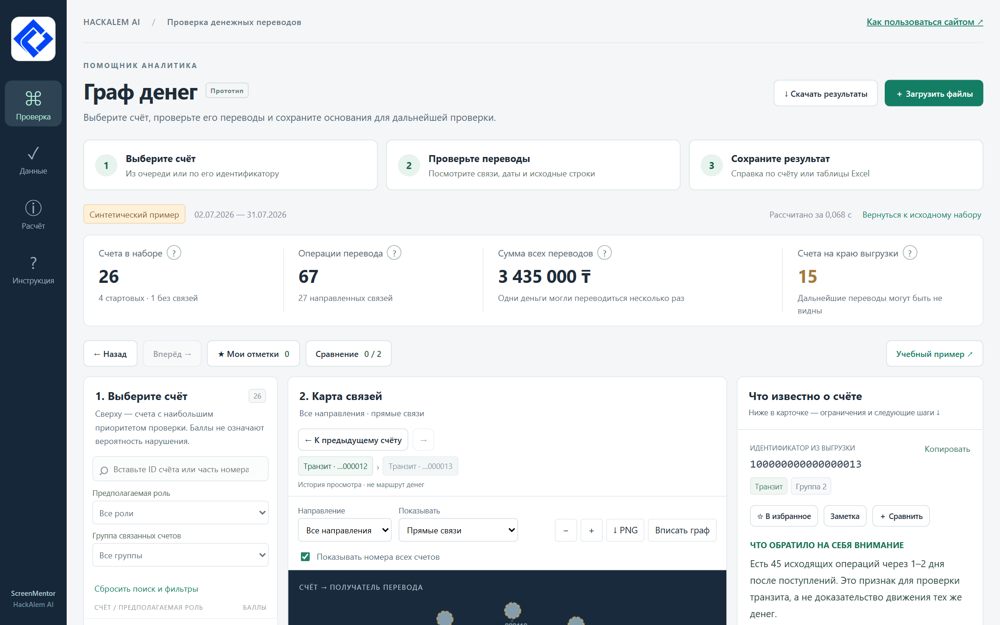
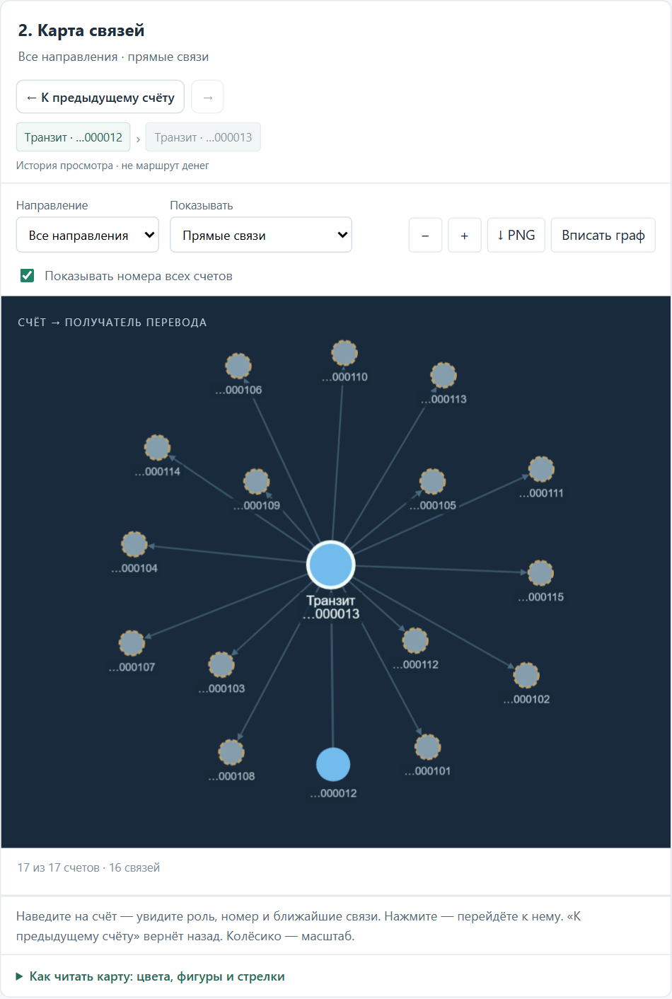

# Отчёт о проекте Граф денег

ScreenMentor

Анализ транзакционной сети и рабочее место аналитика

HackAlem AI · 23 сентября 2026 года

**Назначение отчёта.** Представить жюри и владельцу задачи работающий прототип, объяснить аналитический подход и показать, как детали интерфейса, обработки данных и выгрузок поддерживают проверку результатов.

«Граф денег» превращает три таблицы переводов в очередь проверки счетов, карту связей и объяснения с исходными операциями. Аналитик может проследить основание гипотезы, увидеть ограничения данных и сохранить результат для дальнейшей работы.

**Результат.** Основной сценарий реализован и проверен на полном наборе кейса. Выводы остаются гипотезами: проект помогает выбрать направление проверки и не устанавливает нарушение.

| Счета | Связи | Операции |
| --- | --- | --- |
| 2 248 | 3 119 | 4 840 |

Полный расчёт с выгрузками — 0,966 секунды в одном локальном прогоне. Проверки Python — 35 из 35 пройдены. Эти показатели характеризуют реализацию и скорость на проверенном наборе, а не точность выявления нарушений.

Метод 1.1.0 · функциональная версия 78fb39f · Windows · Python 3.12

<!-- PAGEBREAK -->

## Задача пользователя и устройство решения

По отдельным строкам переводов трудно понять, какие счета собирают средства, какие распределяют их дальше и кого следует проверить сначала. Простой рейтинг по обороту не объясняет положение счёта в сети и не учитывает неполноту наблюдения.

Основной пользователь — AML-аналитик или специалист финансового мониторинга. Его результат работы в прототипе — обоснованный выбор счетов для дальнейшего анализа, проверенные ссылки на операции и список недостающих сведений.

Файлы проверяются на согласованность. Затем рассчитываются структурные и временные признаки, гипотезы ролей, сообщества и приоритет. Интерфейс и выгрузки используют один результат расчёта. Дополнительный разбор цепочек и чувствительности вызывается отдельно и не меняет основной рейтинг.

| Компонент | Назначение |
| --- | --- |
| Python и библиотеки данных | Чтение Parquet, проверки и расчёт признаков |
| NetworkX | Направленный граф, центральности и сообщества |
| FastAPI и Uvicorn | Загрузка, поиск, карточки, разбор и экспорт |
| JavaScript и Cytoscape.js | Интерфейс и интерактивная карта |
| CSV XLSX HTML PNG | Результаты для проверки и передачи |

Языковая модель в работающем приложении не используется. Локальный помощник отвечает на четыре готовые темы по рассчитанным фактам. Codex использовался при разработке и тестировании; зависимости и использованные материалы раскрыты в README.

<!-- PAGEBREAK -->

## Понятный интерфейс для последовательной проверки

Экран построен вокруг трёх действий: **выбрать счёт → проверить переводы → сохранить результат**. На широком экране очередь, граф и карточка находятся рядом; на телефоне они доступны последовательно при прокрутке.

*Иллюстрация интерфейса на синтетическом примере. Данные организатора в изображения отчёта не включены.*

В очереди видны полный идентификатор, предполагаемая роль, место и баллы. Поиск по полному номеру или части номера применяется ко всему набору. Фильтры по роли и группе помогают сузить список; счётчик различает найденные и показанные записи. Сброс фильтров не удаляет заметки.

Карточка сначала объясняет, что обратило на себя внимание. Затем показывает наблюдаемые переводы, ограничения и следующую проверку. Формулы и альтернативные роли раскрываются отдельно: пользователь может понять результат без знания PageRank или Louvain.

Название набора, период и время расчёта остаются на виду. Подсказки рядом со статистикой объясняют, почему сумма переводов не равна ущербу, а отсутствие исходящих на краю выгрузки не доказывает остановку денег.

Логотип команды расположен в боковой панели и во вкладке браузера. Кнопки дополнены текстовыми названиями; важные состояния описываются словами. Управление вкладками разбора поддерживает стрелки, Home и End. Удобство для профессиональных аналитиков ещё требует отдельного пользовательского исследования.

<!-- PAGEBREAK -->

## Навигация по карте связей

Карта показывает направление переводов и предполагаемые роли. Под узлами по умолчанию видны окончания идентификаторов; совпадающие окончания автоматически удлиняются. Полный номер доступен при наведении и в карточке.

*Учебный пример. История просмотра обозначена отдельно от направления денежных переводов.*

Наведение выделяет ближайшие связи. «Откуда поступали» и «Куда отправляли» выбирают направление обхода; глубина ограничивается одним или двумя переходами. Сначала отображаются до 30 узлов, лимит можно увеличивать по 30 до 400. Непоказанные узлы остаются в расчёте.

Кнопки возврата и перехода вперёд позволяют восстановить ранее открытый счёт. Последние три позиции истории доступны прямо над картой; общая история содержит до 30 переходов. История просмотра не является доказанным маршрутом средств.

Колёсико и кнопки масштаба работают вместе с перетаскиванием. «Вписать граф» размещает уже показанные узлы внутри области карты. Это не полноэкранный режим. После просмотра отдельной цепочки кнопка возврата открывает обычное окружение счёта.

<!-- PAGEBREAK -->

## Корректность и границы исходных данных

Надёжность результата начинается с проверки входа. Проект сверяет схемы, типы, ссылки, уникальность счетов и агрегированных пар, даты, суммы и число переводов. Агрегаты сравниваются с отдельными операциями в целых тиынах.

| Особенность | Решение в проекте |
| --- | --- |
| Длинные идентификаторы | Точные целые на сервере, строки в JSON и браузере, текстовые ячейки XLSX |
| Счета без связей | Все узлы берутся из nodes.parquet; 19 изолятов сохранены |
| Одинаковые строки операций | 97 повторяющихся строк сохранены: ID платежа отсутствует |
| Обрыв на глубине 4 | 444 граничных узла отмечены; отсутствие исходящих не даёт им роль terminal |
| Неполные входящие у seed | Отношение отправленного к полученному не трактуется как полный баланс |
| Порог и период выгрузки | Переводы ниже 5 000 тенге и вне периода нельзя восстановить из этих данных |

Номер исходной строки позволяет проверить конкретную операцию в конкретном файле. Контрольные суммы SHA-256 связывают результат с тремя входами. Это важно при повторном запуске и сравнении выгрузок: одинаковое имя файла не гарантирует одинаковое содержимое.

В данных нет сведений о личности, остатках на счетах и точном времени внутри дня. Приложение не добавляет вымышленные клиентские атрибуты. Совокупный оборот отражает сумму операций, в которой одни средства могли учитываться на нескольких переходах.

Проверки предотвращают известные ошибки обработки, но не подтверждают полноту исходной банковской выгрузки. Подсказки и справки сохраняют это различие, чтобы пользователь не воспринимал отсутствие данных как установленный факт.

<!-- PAGEBREAK -->

## Объяснимые роли и проверка гипотез

Каждый счёт получает роль из обязательного словаря, оценку выраженности признаков, группу, приоритет и текстовое основание. Формальные условия и пороги опубликованы в README. При недостатке признаков выбирается peripheral; это не означает отсутствие риска.

| Роль | Какие признаки используются |
| --- | --- |
| Сбор средств | Несколько отправителей, стартовые ветви и входящие операции |
| Распределение | Число получателей и исходящих операций |
| Транзит | Соотношение потоков и отправления через 1–2 дня после поступлений |
| Получатель как гипотеза | Повторные поступления вне границы глубины при отсутствии наблюдаемых исходящих |
| Связующее звено | Достижимость из seed, связи разных групп и положение в графе |
| Недостаточно признаков | Ни одна из остальных оценок не достигла порога |

Приоритет объединяет положение среди связей, стартовые ветви, оборот и признаки роли. На сайте видны четыре вклада. Ранжирование помогает организовать работу; оно не является вероятностью нарушения.

**Проверка времени.** Для выбранного пути система ищет подходящую последовательность дат отдельных операций. Различаются строго возрастающие даты, неопределённость порядка в один день и несовместимость дат. Даже допустимая последовательность не доказывает прохождение одних и тех же денег.

**Проверка чувствительности.** Восемь сценариев меняют веса по одному на ±20% с нормировкой. Пользователь видит диапазон места и попадание в топ-20, а также сравнение с рейтингами по обороту и числу связей. Основной результат остаётся прежним.

На ранее проверенном наборе состав топ-20 совпал во всех восьми сценариях; пересечение с топом по обороту составило 7 из 20, по числу связей — 13 из 20. Это характеристика чувствительности и различия списков, не доказательство большей точности.

<!-- PAGEBREAK -->

## Выгрузки для Excel и передачи результата

Кнопка «Скачать результаты» открывает выбор формата. Для обычной работы в Excel предназначен results.xlsx. Три конкурсных CSV сохраняют фиксированные схемы для автоматической проверки.

| Результат | Содержимое и особенности |
| --- | --- |
| XLSX | Приоритеты, все счета, сообщества и сведения о выгрузке |
| nodes_roles.csv | Все 2 248 счетов с ролями, оценками, группами и основаниями |
| clusters.csv | 91 группа с размером, seed, внутренним оборотом и гипотезой |
| top_nodes.csv | 100 приоритетных счетов с объяснением |
| manifest.json | Период, хеши, предупреждения, время и параметры метода |
| HTML справка | Выбранный счёт, граф, источники, ограничения и дальнейшие действия |
| PNG карты | Видимая область с контекстом выбранного счёта и легендой |

**Оформление XLSX.** Текст центрирован по горизонтали и вертикали, ячейки имеют границы, заголовки выделены тёмной заливкой. Первая строка закреплена; на листах результатов есть фильтры. Ширины столбцов заданы по назначению, длинные объяснения переносятся.

**Точность XLSX.** Идентификаторы записаны текстом, чтобы Excel не округлял длинные номера. Оценки, количества и суммы сохраняются числами; суммы с более чем 15 значащими цифрами — текстом ради точности. Строки, похожие на формулы, не превращаются в исполняемые формулы.

**Особенности CSV.** UTF-8 с BOM сохраняет русские тексты при корректном чтении. Однако CSV не хранит форматирование и типы ячеек: обычное открытие в Excel может округлить ID. Поэтому инструкция рекомендует XLSX или явный импорт идентификаторов как текста.

Фильтры интерфейса не ограничивают полные выгрузки. Лист приоритетов содержит до 100 счетов; в интерфейсе баллы показаны до 100, в файлах оценки — от 0 до 1. Группы в интерфейсе начинаются с 1, cluster_id в файлах — с 0.

<!-- PAGEBREAK -->

## Инструменты ежедневной работы и обучение

Избранное и заметки позволяют продолжить проверку позднее. Для счёта можно записать комментарий до 4 000 символов и этап «Проверить», «Нужны данные» или «Просмотрен». Сохранение автоматическое с подтверждением или предупреждением об ошибке.

Сравнение двух счетов объединяет роли, места, суммы, признаки и ограничения в одной таблице. Показатели берутся из готового расчёта; сравнение не меняет рейтинг и не выводит подозрительность из одного большого оборота.

| Деталь поведения | Для чего нужна |
| --- | --- |
| Разделение заметок по хешам входов | Одинаковые ID в разных наборах не смешивают записи |
| Восстановление фильтров и выбранного счёта | Обновление страницы не требует повторять навигацию, пока запуск доступен |
| Предупреждение об отказе хранилища | Пользователь понимает, что временный черновик нужно скопировать |
| Индикатор загрузки и контроль запросов | Старый ответ не подменяет сведения о вновь выбранном счёте |
| Учебный набор в новой вкладке | Знакомство с продуктом не заменяет текущую рабочую выгрузку |
| Инструкция и подсказки | Термины, действия и причины ограничений объясняются на месте |

Учебный сценарий состоит из пяти шагов: поступления от стартовых счетов, цепочка и даты, исходная операция, граница наблюдения и сохранение справки. Его можно завершить и продолжить самостоятельное изучение.

Заметки хранятся только в данном браузере по данному адресу. Они не синхронизируются с телефоном, не отправляются серверу и не входят в аналитические выгрузки. Очистка браузера может удалить их. Масштаб и положение карты, отдельная цепочка и вкладка разбора после перезагрузки не сохраняются.

PNG сохраняет текущий вид карты; HTML-справку можно открыть без сервера и напечатать в PDF. Эти форматы дополняют таблицы, но не заменяют исходные операции при проверке гипотезы.

<!-- PAGEBREAK -->

## Проверки качества и воспроизводимость

Результат можно получить одной командой pipeline после установки зависимостей, без ручного редактирования данных. Версии библиотек зафиксированы. Для первичного знакомства доступен встроенный синтетический набор; закрытый комплект организатора не включается в Git.

| Проверка | Подтверждённый результат |
| --- | --- |
| Python тесты | 35 пройдены; данные, API, роли, цепочки, экспорт и изоляция запусков |
| Проверка конкурсных CSV | 2 248, 91 и 100 строк; обязательные поля заполнены; оценки в диапазоне 0–1 |
| Длина evidence | Максимум 127 символов при ограничении 200 |
| Локальный полный прогон | 0,966 секунды с созданием выгрузок, включая XLSX |
| Браузерные проверки | Пять сценариев для основных функций и ширин экрана 390–1600 px |
| Excel | Ранее проверено открытие и сохранение 2 439 строк результатов без изменения значений |
| Регрессия рабочего места | На наборе кейса и демо CSV совпали побайтно с версией до улучшений |

Тесты отдельно проверяют изоляты, граничные узлы, длинные ID, кириллицу, повторяющиеся операции и временные последовательности. Для интерфейса проверяются поиск, источники, экспорт, возврат по карте, фильтры направлений, заметки, сравнение и учебный сценарий.

**Пределы доказательств.** Размеченных ролей нет, поэтому accuracy и F1 не заявляются. Исследование с AML-аналитиками и замер экономии времени ещё не проводились. Успешные тесты не означают отсутствие любых ошибок на неизвестных входах.

Проверенная среда — Windows и Python 3.12. Docker-конфигурация подготовлена, но сборка контейнера здесь не проверялась. Лимиты входа — 20 000 узлов, 100 000 рёбер и 200 000 операций; скорость на этих предельных размерах не подтверждена.

<!-- PAGEBREAK -->

## Соответствие задаче и дальнейшее развитие

Пять обязательных функций кейса реализованы: воспроизводимый расчёт, роли и основания для всех узлов, формальные критерии, сообщества, приоритетный список с визуализацией. Дополнительно доступны временная проверка маршрутов, работа с границами данных, справка, чувствительность приоритета и инструменты аналитика.

| Область оценки | Что можно показать проверяющему |
| --- | --- |
| Работоспособность | Живой запуск и три CSV из исходных Parquet |
| Технический подход | Схему решения, правила, тесты и связанный сценарий от факта до источника |
| Документация | README, инструкцию на сайте и полный обзор деталей реализации |
| Практическая ценность | Разбор 2–3 счетов и результат для дальнейшего запроса данных |
| Развитие | План экспертной проверки, масштабирования и командной работы |

Ближайший следующий этап — проверить гипотезы и понятность интерфейса с экспертом: одинаковые задания вручную и в приложении, время поиска основания, правильность ссылок и обоснованность выбранных счетов. После такой проверки можно уточнять пороги и измерять пользу.

Для промышленного развития потребуются серверное хранение заметок, индивидуальные права доступа, аудит действий, интеграции и фоновые расчёты. Для миллиона узлов нужны колоночное хранилище, предрасчёт признаков и сообществ, серверные выборки окружения и стабильная пагинация. Текущий NetworkX в памяти такой масштаб не заявляет.

**Перед сдачей.** Необходимо проверить доступ жюри к актуальной версии репозитория и развёрнутому приложению, передачу трёх конкурсных файлов, историю прогресса и регламент демонстрации. Наличие функций не гарантирует максимальный балл: оценка зависит от проверяемости и защиты.

**Материалы проекта.** README.md — запуск, метод и ограничения. USER_GUIDE.md — пошаговая инструкция. PROJECT_FEATURES.md — полный обзор деталей. FOR_JUDGES.md — краткое объяснение. DEMO_SCRIPT.md — сценарий защиты. Код функциональной версии: 78fb39f в ветке codex/graph-money.

Репозиторий команды: https://github.com/BAITC-Hacks/hack-dea84e5c-screenmentor

Кейс организатора: https://docs.google.com/document/d/1JPLU-G6R25Ge2hVaY2J9cqvrx7FGExj87XKwJPaMz3o/preview
